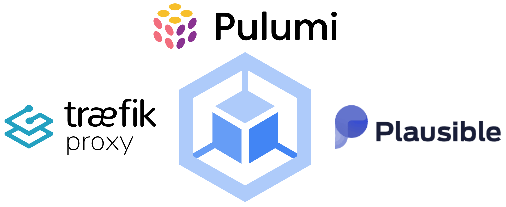
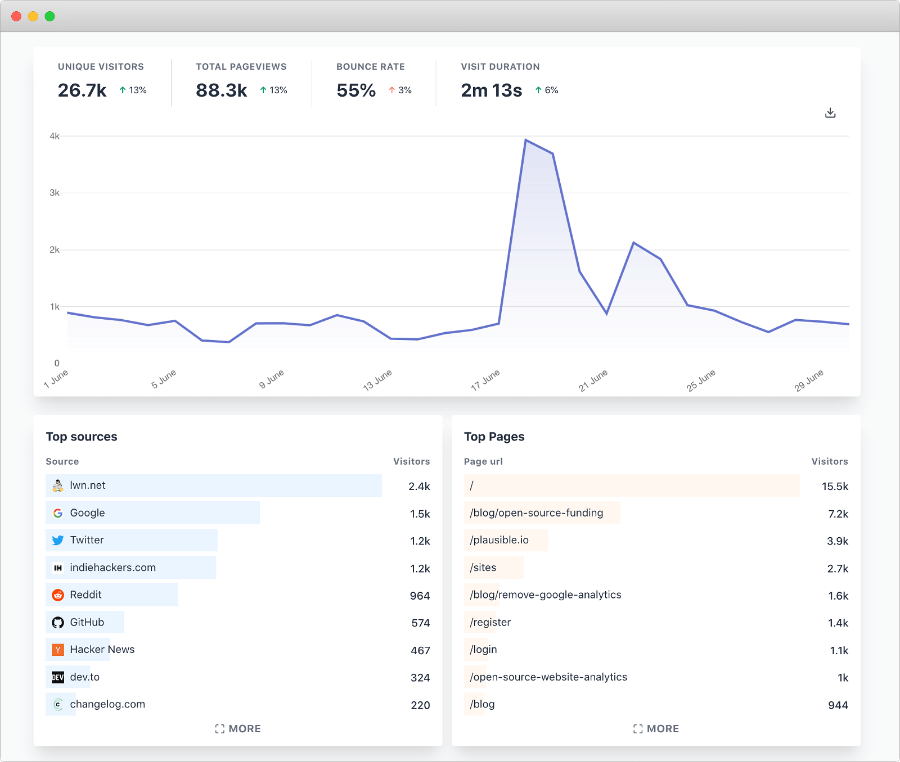
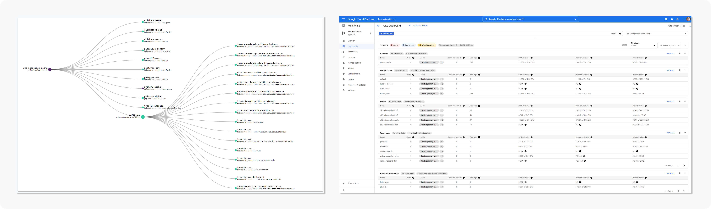

[![Contributors][contributors-shield]][contributors-url]
[![Forks][forks-shield]][forks-url]
[![Stargazers][stars-shield]][stars-url]
[![Issues][issues-shield]][issues-url]
[![MIT License][license-shield]][license-url]
[![LinkedIn][linkedin-shield]][linkedin-url]

 

  

<h2 align="center">Self-Hosted Plausible Analytics</h2>

  

    Plausibe Analytics hosted on the Google Cloud Platform
     
    <a href="https://github.com/snarkipus/gcp-plausible/issues">Report Bug</a>
    ·
    <a href="https://github.com/snarkipus/gcp-plausible/issues">Request Feature</a>
  

## DISCLAIMER
This was a largely academic exercise intended to learn a about cloud technology and infrastructure. If you utilize this self-hosting solution for Plausible Analytics, PLEASE make an effort to support them by either using their hosted solution or contributing to their project. 

## About
Self-hosted, privacy focused web analytics deployed to Kubernetes on the Google Cloud Platform. Built using Pulumi (TypeScript), an open source Infrastructure as Code framework.

(<a href="#top">back to top</a>)

### Features
- [Plausible Analytics](https://plausible.io/): lightweight and open source web analytics (no cookies) and fully compliant with GDPR, CCPA and PECR
- [Traefik Proxy](https://traefik.io/traefik/): leading modern reverse proxy and load balancer that makes deploying microservices easy
  - SSL Termination
  - [Cloudflare](https://www.cloudflare.com/) integration
- [Pulumi](https://www.pulumi.com/): build, deploy, and manage cloud applications and infrastructure using  the power of familiar programming languages and tooling
- [Google Kubernetes Engine](https://cloud.google.com/kubernetes-engine): automated and scalable managed Kubernetes platform
  - Single-click clusters which can scale up to 15,000 nodes (four-way autoscaling)
  - High-availability control plane including multi-zonal and regional clusters
  - Secure: container image vulnerability scanning and data encryption
  - [_Autopilot Mode_](https://cloud.google.com/kubernetes-engine/docs/concepts/autopilot-overview): hands-off, fully managed solution that manages the entire cluster’s infrastructure without worrying about configuring and monitoring 

### Infrastructure Dashboards

(<a href="#top">back to top</a>)

## Getting Started

### Prerequisites

## Contributing

Contributions are what make the open source community such an amazing place to learn, inspire, and create. Any contributions you make are **greatly appreciated**.

If you have a suggestion that would make this better, please fork the repo and create a pull request. You can also simply open an issue with the tag "enhancement".
Don't forget to give the project a star! Thanks again!

1. Fork the Project
2. Create your Feature Branch (`git checkout -b feature/AmazingFeature`)
3. Commit your Changes (`git commit -m 'Add some AmazingFeature'`)
4. Push to the Branch (`git push origin feature/AmazingFeature`)
5. Open a Pull Request

(<a href="#top">back to top</a>)

<!-- LICENSE -->
## License

Distributed under the MIT License. See `LICENSE.txt` for more information.

(<a href="#top">back to top</a>)

<!-- CONTACT -->
## Contact

Matt Jackson - [@snarkipus](https://twitter.com/snarkipus) - matt@jacksonsix.com

Project Link: [https://github.com/snarkipus/gcp-plausible](https://github.com/snarkipus/gcp-plausible)

(<a href="#top">back to top</a>)

[contributors-shield]: https://img.shields.io/github/contributors/snarkipus/gcp-plausible.svg?style=for-the-badge
[contributors-url]: https://github.com/snarkipus/gcp-plausible/graphs/contributors
[forks-shield]: https://img.shields.io/github/forks/snarkipus/gcp-plausible.svg?style=for-the-badge
[forks-url]: https://github.com/snarkipus/gcp-plausible/network/members
[stars-shield]: https://img.shields.io/github/stars/snarkipus/gcp-plausible.svg?style=for-the-badge
[stars-url]: https://github.com/snarkipus/gcp-plausible/stargazers
[issues-shield]: https://img.shields.io/github/issues/snarkipus/gcp-plausible.svg?style=for-the-badge
[issues-url]: https://github.com/snarkipus/gcp-plausible/issues
[license-shield]: https://img.shields.io/github/license/snarkipus/gcp-plausible.svg?style=for-the-badge
[license-url]: https://github.com/snarkipus/gcp-plausible/blob/master/LICENSE.txt
[linkedin-shield]: https://img.shields.io/badge/-LinkedIn-black.svg?style=for-the-badge&logo=linkedin&colorB=555
[linkedin-url]: https://linkedin.com/in/snarkipus

